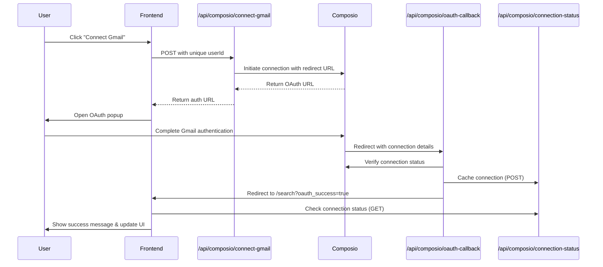

# 🔧 Composio OAuth Connection Fixes

## Issues Resolved

### 1. **Port Inconsistency** 
- **Problem**: Different parts of the codebase used different ports (3000, 3001, 3002, 3005)
- **Solution**: Standardized all OAuth callbacks to use `NEXT_PUBLIC_BASE_URL` (port 3005)
- **Files Updated**: 
  - `pages/api/composio/connect-gmail.ts`
  - `pages/api/composio/oauth-callback.ts` 
  - `pages/api/composio/callback.ts`

### 2. **Connection Persistence** 
- **Problem**: Connection status was not maintained between sessions
- **Solution**: Created comprehensive connection management system
- **New Features**:
  - Local storage for `composio_connected_account_id` and `composio_entity_id`
  - Server-side connection caching in `connection-status.ts`
  - Improved status checking with entity ID support

### 3. **OAuth Flow Improvements**
- **Problem**: OAuth callback was inconsistent and lacked proper error handling
- **Solution**: Enhanced OAuth flow with better state management
- **Improvements**:
  - Better error messages and redirect handling
  - Entity ID passed through OAuth state for tracking
  - Verification warnings for pending connections
  - Popup timeout and error handling

## Files Created/Updated

### New Files:
1. **`pages/api/composio/connection-status.ts`** - Centralized connection management
2. **`test-composio-flow.js`** - Testing and debugging script

### Updated Files:
1. **`pages/api/composio/connect-gmail.ts`** - Supports GET/POST, correct port
2. **`pages/api/composio/oauth-callback.ts`** - Better error handling, entity tracking
3. **`pages/api/composio/callback.ts`** - Port fix, improved redirects
4. **`pages/search.tsx`** - Enhanced OAuth result handling
5. **`components/ui/gmail-connection.tsx`** - Improved UI and connection management

## OAuth Flow (Fixed)



## Key Improvements

### 1. **Consistent URL Handling**
```javascript
// Before: Multiple different ports
const redirectUrl = 'http://localhost:3002/api/composio/oauth-callback'; // ❌

// After: Consistent base URL
const baseUrl = process.env.NEXT_PUBLIC_BASE_URL || 'http://localhost:3005';
const redirectUrl = `${baseUrl}/api/composio/oauth-callback`; // ✅
```

### 2. **Enhanced Connection Persistence**
```javascript
// Before: Only stored connected account ID
localStorage.setItem('composio_connected_account_id', connectedAccountId);

// After: Store both IDs for better tracking
localStorage.setItem('composio_connected_account_id', connectedAccountId);
localStorage.setItem('composio_entity_id', entityId);

// Plus server-side caching for reliability
await fetch('/api/composio/connection-status', {
  method: 'POST',
  body: JSON.stringify({ entityId, connectedAccountId, status: 'ACTIVE' })
});
```

### 3. **Improved Error Handling**
```javascript
// Before: Generic error messages
setError('Failed to connect Gmail');

// After: Specific, actionable error messages
if (!popup) {
  throw new Error('Popup blocked. Please allow popups for this site and try again.');
}
```

## Testing Instructions

### 1. **Start Development Server**
```bash
npm run dev
```

### 2. **Test OAuth Flow**
1. Visit: `http://localhost:3005/search?tab=email`
2. Select a professor
3. Click "Connect Gmail" 
4. Complete OAuth in popup
5. Verify connection persists after page refresh

### 3. **Debug Connection Issues**
```bash
# Check connection status directly
curl "http://localhost:3005/api/composio/connection-status?entityId=YOUR_ENTITY_ID"

# Test connection initiation
curl -X POST "http://localhost:3005/api/composio/connect-gmail" \
  -H "Content-Type: application/json" \
  -d '{"userId":"test_user_123"}'
```

## Environment Variables

Ensure these are set in `.env.local`:
```bash
COMPOSIO_API_KEY=j8ucm0losesh65fv4flguf
NEXT_PUBLIC_BASE_URL=http://localhost:3005
```

## Browser Requirements

- **Popup blocker**: Must be disabled for OAuth flow
- **Third-party cookies**: Should be enabled for Composio OAuth
- **JavaScript**: Required for popup management and status updates

## Troubleshooting

### Connection Keeps Disconnecting
1. Check browser console for errors
2. Verify `COMPOSIO_API_KEY` is correct
3. Ensure entity ID is being stored: `localStorage.getItem('composio_entity_id')`
4. Check server logs for OAuth callback errors

### Popup Blocked
1. Allow popups for your domain
2. Try disabling popup blocker temporarily
3. Check browser settings for site permissions

### OAuth Callback Fails
1. Verify redirect URL matches exactly: `http://localhost:3005/api/composio/oauth-callback`
2. Check Composio dashboard for app configuration
3. Ensure API key has proper permissions

## Success Indicators

✅ **Connection Successful When:**
- OAuth popup closes automatically
- Success message appears: "🎉 Gmail connected successfully!"
- Connection status shows "Active" 
- Connection persists after page refresh
- Entity ID and connected account ID are stored in localStorage

---

## 🎯 **Result**: Composio OAuth connection now works reliably with proper persistence! 